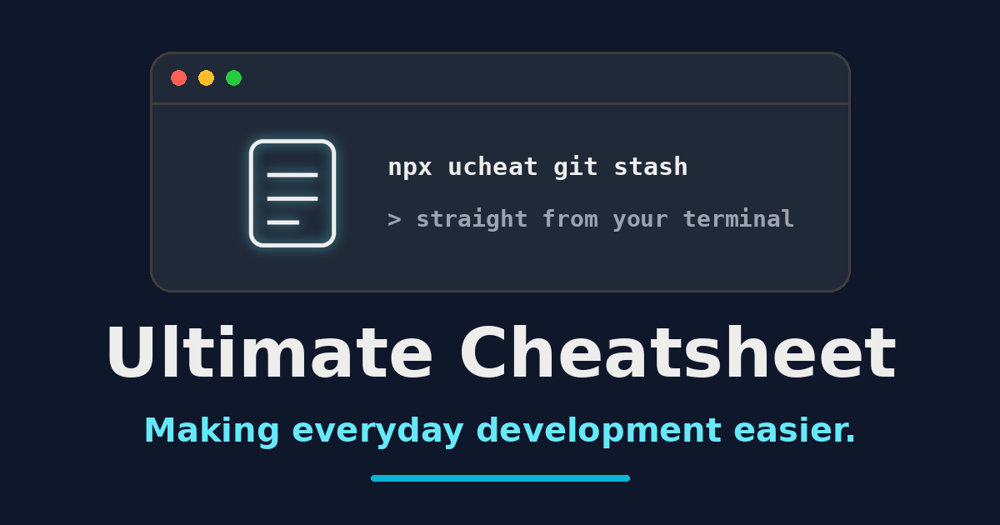

# Ultimate Cheatsheet for Developers

[](https://github.com/zlatanstajic/ultimate-cheatsheet-for-developers/actions/workflows/ci.yml)
[](LICENSE.md)
[](https://nodejs.org/)
[](https://zlatanstajic.github.io/ultimate-cheatsheet-for-developers/)

> Making everyday development easier.

A curated collection of developer cheatsheets and resource lists written in plain Markdown. The same content is published as a Jekyll site on GitHub Pages, searched in the browser through a prebuilt index, read from the terminal through the `ucheat` CLI, and exported offline as print-ready HTML or a VS Code snippet bundle.



## Table of Contents

- [Features](#features)
- [Tech Stack](#tech-stack)
- [Cheatsheets](#cheatsheets)
  - [Knowledgebase](#knowledgebase)
  - [Shell](#shell)
- [Install](#install)
  - [Requirements](#requirements)
  - [Local Setup](#local-setup)
- [Usage](#usage)
  - [Website](#website)
  - [Search](#search)
  - [CLI](#cli)
  - [Exports](#exports)
- [Content Metadata](#content-metadata)
- [Testing](#testing)
- [Continuous Integration](#continuous-integration)
  - [Pre-commit Hook](#pre-commit-hook)
- [Open Graph Image](#open-graph-image)
- [Contributors](#contributors)
- [Contributing](#contributing)
- [License](#license)

---

## Features

- **Shell cheatsheets:** Command references for seventeen tools, from git and Docker to jq, tmux, and systemctl.
- **Knowledgebase lists:** Curated collections of repositories, learning sources, tools, books, and Linux applications.
- **Plain Markdown source:** Every page is a Markdown file with no build step required to read or edit it.
- **Browser search:** A prebuilt lunr index powers client-side search that links straight to the matching page section.
- **Terminal CLI:** The `ucheat` command renders any section in the terminal with fuzzy section matching.
- **Freshness metadata:** Each content page attests when it was last reviewed and which tool version it was verified against.
- **Print export:** A generated HTML tree turns each section into its own card for clean per-section page breaks when printing.
- **Snippet export:** Commented shell commands are extracted into a VS Code snippet bundle with placeholder tabstops.
- **Validation pipeline:** Lint, link, and spell checks run on every push, every pull request, and every local commit.
- **Generated contributor list:** The contributor table is rebuilt from `git shortlog` with no GitHub token or network access.

[⬆ back to top](#table-of-contents)

---

## Tech Stack

- **Content:** Markdown with YAML frontmatter
- **Site:** Jekyll with `jekyll-theme-minimal` and kramdown, published on GitHub Pages
- **Search:** A lunr index built at commit time, queried by `assets/js/search.js` in the browser
- **CLI:** Node.js 20 or newer with `fuse.js`, `marked`, and `marked-terminal`
- **Quality:** remark-cli, markdown-link-check, cspell, Husky, and lint-staged
- **Exports:** A hand-rolled mdast-to-HTML serializer and a VS Code snippet builder
- **Assets:** Python 3 with Pillow for the Open Graph image

[⬆ back to top](#table-of-contents)

---

## Cheatsheets

### Knowledgebase

|Name|Description|
|---|---|
|[GitHub Repos](knowledgebase/github-repos.md)|Curated list of useful GitHub repositories for web development.|
|[Learning Sources](knowledgebase/learning-sources.md)|Useful learning sources and documentation for web development.|
|[Web Development Tools](knowledgebase/web-development-tools.md)|Handy tools and utilities for web developers.|
|[Books To Read](knowledgebase/books-to-read.md)|Recommended books for software developers.|
|[Linux Apps](knowledgebase/linux-apps.md)|Recommended Linux applications for developers.|

### Shell

|Name|Description|
|---|---|
|[Composer](shell/composer.md)|Dependency management for PHP projects.|
|[cURL](shell/curl.md)|Command-line tool for transferring data with URLs.|
|[Git](shell/git.md)|Version control system for tracking code changes.|
|[Git Crypt](shell/git-crypt.md)|Transparent file encryption for version control.|
|[Linux](shell/linux.md)|Useful Linux commands and tips.|
|[MySQL](shell/mysql.md)|Commands for MySQL database management.|
|[PostgreSQL](shell/postgresql.md)|PostgreSQL relational database management.|
|[Node](shell/node.md)|Node.js runtime and command-line usage.|
|[npm](shell/npm.md)|Node.js package manager commands.|
|[Python](shell/python.md)|Python programming language and package management.|
|[Docker](shell/docker.md)|Container platform for building and running applications.|
|[Redis](shell/redis.md)|In-memory data structure store for caching and data management.|
|[PHP](shell/php.md)|PHP command-line usage and scripting.|
|[SSH](shell/ssh.md)|Secure remote login and command execution.|
|[jq](shell/jq.md)|Command-line JSON processor.|
|[tmux](shell/tmux.md)|Terminal multiplexer for sessions, windows, and panes.|
|[systemctl](shell/systemctl.md)|Control the systemd system and service manager.|

Each folder also has its own index page: [`knowledgebase/README.md`](knowledgebase/README.md) and [`shell/README.md`](shell/README.md). When a page is added or renamed, both this table and the folder index need the new link.

[⬆ back to top](#table-of-contents)

---

## Install

Reading the cheatsheets needs nothing installed — open any Markdown file on GitHub or browse the [published site](https://zlatanstajic.github.io/ultimate-cheatsheet-for-developers). The steps below set up the validation and export tooling for contributors.

### Requirements

- Node.js 20 or newer with npm, for the validation tooling, the CLI, and the exports
- Python 3 with [Pillow](https://pypi.org/project/pillow/), only to regenerate the [Open Graph image](#open-graph-image)
- Ruby with [Jekyll](https://jekyllrb.com/), only to preview the published site locally; GitHub Pages builds it on push

### Local Setup

Clone the repository and install the tooling:

```bash
git clone https://github.com/zlatanstajic/ultimate-cheatsheet-for-developers.git
cd ultimate-cheatsheet-for-developers
npm install
```

`npm install` runs the `prepare` script, which installs the Husky [pre-commit hook](#pre-commit-hook). Verify the setup with:

```bash
npm test
```

There is no application to start and no environment file to create.

[⬆ back to top](#table-of-contents)

---

## Usage

### Website

The site is published from `master` to `https://zlatanstajic.github.io/ultimate-cheatsheet-for-developers` by GitHub Pages, using the settings in [`_config.yml`](_config.yml). Jekyll renders every Markdown page with the theme's `default` layout and excludes `bin/`, `scripts/`, and the CLI index from the site.

### Search

[`search.html`](search.html) queries a prebuilt lunr index and links each result to the matching page and section anchor. The index lives in `assets/search-index.json` and is regenerated by the pre-commit hook; to rebuild it by hand, run:

```bash
npm run build:index
```

### CLI

[`bin/ucheat.mjs`](bin/ucheat.mjs) renders cheatsheet sections in the terminal. From a clone:

```bash
# Show usage and the list of available tools
node bin/ucheat.mjs --help

# List the sections of a tool's cheatsheet
node bin/ucheat.mjs docker

# Render a section (fuzzy-matched, so "git stsh" works too)
node bin/ucheat.mjs git stash
```

The same entry point is packaged for npm as `ucheat`, so a published release is callable as `npx ucheat git stash`. It exits `0` when a section was rendered, `1` when nothing matched, and `2` when the query was ambiguous, in which case it prints the closest candidates instead of guessing.

The CLI reads the prebuilt index at `assets/cli-index.json` and never parses Markdown at runtime. Editing anything under `shell/`, `knowledgebase/`, or this README changes that index:

```bash
npm run build:cli-index
```

Commit the regenerated `assets/cli-index.json` alongside the content change — `npm test` fails on any drift.

### Exports

To take the cheatsheets offline, generate the export artifacts locally:

```bash
npm run build:print     # print-optimized HTML pages in dist/print/
npm run build:snippets  # VS Code snippet bundle in dist/snippets/cheatsheets.code-snippets
npm run build:export    # both of the above
```

Output lands in the git-ignored `dist/` folder. Open any page from `dist/print/` in a browser and print to PDF for a paper copy, one card per section. Place `cheatsheets.code-snippets` in your VS Code snippets folder to get the shell commands as editor snippets.

The snippet builder has a self-test that asserts against real cheatsheet content and writes nothing:

```bash
node scripts/build-snippets.mjs --check
```

[⬆ back to top](#table-of-contents)

---

## Content Metadata

Every page under `shell/` and `knowledgebase/` opens with a YAML frontmatter block:

```yaml
---
last_reviewed: 2026-03-27
tested_on: git 2.43
---
```

| Key | Required | Description |
|---|---|---|
| `last_reviewed` | Yes | ISO date (`YYYY-MM-DD`) on which the page content was last verified. A manual attestation; nothing derives it from git. |
| `tested_on` | No | Tool version the commands were verified against. A string, or a YAML list when several versions were checked. |

Two report-only scripts read this metadata. Both always exit zero and neither is part of `npm test` or the pre-commit hook:

```bash
npm run check:freshness  # writes assets/freshness-badge.json, the badge above
npm run check:drift      # lists pages edited after their attested review date
```

The freshness badge counts pages whose `last_reviewed` is older than 183 days, plus pages with a missing or invalid date. The two folder index pages are excluded from the count. Full details are in [CONTRIBUTING.md](CONTRIBUTING.md).

[⬆ back to top](#table-of-contents)

---

## Testing

Run the complete validation suite:

```bash
npm test
```

That runs four gates in order:

| Script | Tool | Config | Purpose |
|---|---|---|---|
| `lint:md` | remark-cli | [`.remarkrc.js`](.remarkrc.js) | Markdown lint; `--frail` treats warnings as errors |
| `check:links` | markdown-link-check | [`.mlc-config.json`](.mlc-config.json) | External and relative link validity |
| `spell` | cspell | [`.cspell.json`](.cspell.json) | Spell check against the project word list |
| `check:cli-index` | Node | — | Rebuilds `assets/cli-index.json` and fails on uncommitted drift |

Each script globs every `*.md` outside `node_modules`, so there is no single-file runner. To check one file, call the tool directly:

```bash
npx remark --quiet --frail shell/git.md
npx cspell shell/git.md
npx markdown-link-check --config .mlc-config.json shell/git.md
```

New command flags, tool names, and proper nouns will fail the spell check. Add them to the `words` array in [`.cspell.json`](.cspell.json) rather than rewording the content.

[⬆ back to top](#table-of-contents)

---

## Continuous Integration

Four GitHub Actions workflows run against this repository:

| Workflow | Trigger | What it does |
|---|---|---|
| [`ci.yml`](.github/workflows/ci.yml) | Push and pull requests to `master` | Runs `npm ci` and `npm test` on the current Node LTS |
| [`check-freshness.yml`](.github/workflows/check-freshness.yml) | Content pushes, Mondays 06:00 UTC, manual | Rebuilds `assets/freshness-badge.json` and commits any change |
| [`build-leaderboard.yml`](.github/workflows/build-leaderboard.yml) | Mondays 06:30 UTC, manual | Rebuilds the [Contributors](#contributors) list and commits any change |
| [`release-export.yml`](.github/workflows/release-export.yml) | Manual, takes a `tag` input | Builds both exports and attaches them to a GitHub Release |

The two committing workflows push to `master` as `github-actions[bot]` with `[skip ci]`, only when the generated file actually changed, and share one serialized concurrency group so they never race on the push.

### Pre-commit Hook

The repository includes a Husky hook at [`.husky/pre-commit`](.husky/pre-commit). It runs `lint-staged`, applying the lint, spell, and link checks to staged `*.md` files, then rebuilds the search index and stages `assets/search-index.json` if it changed. The hook is installed by npm's `prepare` script when dependencies are installed. To install or refresh it explicitly, run:

```bash
npm run prepare
```

A failing check aborts the commit. Run `npm test` directly to reproduce the failure. Bypass the hook for a single commit only when necessary with:

```bash
git commit --no-verify
```

[⬆ back to top](#table-of-contents)

---

## Open Graph Image

The social preview at [`assets/img/og-image.png`](assets/img/og-image.png) is generated, not hand-drawn. Regenerate it after changing the project name or tagline:

```bash
python3 scripts/gen-og-image.py
```

The script requires Pillow and a bold DejaVu or Liberation TrueType font. It contains no randomness and no timestamps, so the same inputs produce a byte-identical PNG on every run; if no suitable font is installed it fails loudly rather than falling back to a low-resolution default.

[⬆ back to top](#table-of-contents)

---

## Contributors

Generated from `git shortlog` — regenerate with `npm run leaderboard`.

<!-- CONTRIBUTORS:START -->
1. **Zlatan Stajic** — 13 commits
<!-- CONTRIBUTORS:END -->

[⬆ back to top](#table-of-contents)

---

## Contributing

Contributions are welcome. See [CONTRIBUTING.md](CONTRIBUTING.md) for how to propose a change, add a page, and keep the frontmatter and generated artifacts in sync.

[⬆ back to top](#table-of-contents)

---

## License

This project is licensed under the MIT License. See the [LICENSE](LICENSE.md) file for details.

[⬆ back to top](#table-of-contents)
